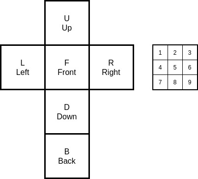

# Rubik's Cube Solver

Something to keep me entertained through the final throes of lockdown #3 in the UK. 

The plan:

- In JS: work out a sensible way of modelling a Rubik's cube, and the available moves. Make sure it is easily interpretable (maybe some 90s style ASCII art output for MVP?)
- Work out the best way to solve this. Using an MDP? Q-learning? Something else? 
- Do we need to build in some tacit knowledge, e.g. strategies at each stage? Or - better - can we let the algorithm learn with no prior knowledge? 
- Build a simple web interface to show the magic happening. 
- Bonus points: use WebGL to show it in 3D (this would be a good starting point).

### Notation



Define six faces: F (front), B (back), L (left), R (right), D (down), U (up).

Squares on a side are numbered 1-9, starting from top-left.

This gives us a notation to work with, e.g. `R.6' would be the right-middle square on the right hand side.

### Ideas about rotations

As per above, each face has nine squares defined, numbered 1-9. Rotations on that face are easy:
* 1 -> 3
* 2 -> 6
* 3 -> 9
* 4 -> 2
* 5 -> 5 (no change)
* 6 -> 8
* 7 -> 1
* 8 -> 4
* 9 -> 7

It is a bit harder for the rows on the other four sides. I think each face will need to be explicitly linked to the other four faces, and the rows. This will need to be directed (say, CW). 

For example: the links for F (front) would be:
```JS
[
    // order matters, but the starting point doesn't
    {
        face: 'U', // or some enum representation
        squares: [7, 8, 9]
    },
    {
        face: 'R',
        squares: [1, 4, 7]
    },
    {
        face: 'B',
        squares: [1, 2, 3] 
    },
    {
        face: 'L',
        squares: [3, 6, 9]
    },

]
```

Working out the numbers gets a bit confusing. The rule needs to be 'if you rotated the face in your direction'.

### Front end

Same as https://github.com/pidg3/node-template

* `npm run dev`: watches TS files for changes (make sure in /src), rebuilds and runs Node again. 
* `npm run prettier-format`: run prettier and fix, default config except tabs = 2 spaces, single quotes.
* `npm run lint`: run ESLint with default config.
* Pre-commit hook setup to check prettier and linting, but without changing anything.
