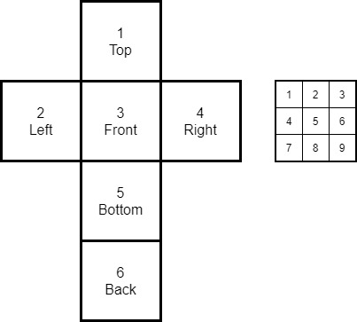

# Rubix Cube Solver

Something to keep me entertained through the final throes of lockdown #3 in the UK. 

The plan:

- In Python: work out a sensible way of modelling a rubix cube, and the available moves. Make sure it is easily interpretable (maybe some 90s style ASCII art output for MVP?)
- Work out the best way to solve this. Using an MDP? Q-learning? Something else? 
- Do we need to build in some tacit knowledge, e.g. strategies at each stage? Or - better - can we let the algorithm learn with no prior knowledge? 
- Build a simple web interface to show the magic happening. 
- Bonus points: use WebGL to show it in 3D.

### Notation

Sides are numbered 1-6. 3 is always the front, other sides as per diagram. 

Squares on a side are numbered 1-9, starting from top-left.

This gives us a notation to work with, e.g. `4.6' would be the right-middle square on the right hand side. This mirrors the 2D array structure as it stands. 

Not sure how easy to reason with this will be when start doing transformations.